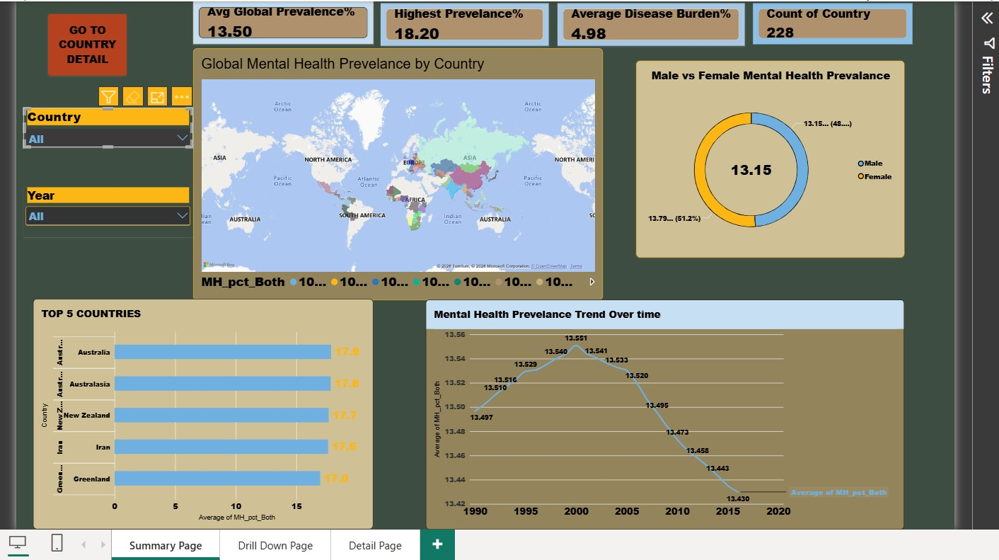

**Name:** Suhani Shukla
**Roll No:** 055
# Global Mental Health Disorder Prevalence Dashboard

## Overview
An interactive Power BI dashboard analyzing global mental health disorder prevalence across ~200 countries from 1990 to present, built to explore trends by country, gender, and disease burden.

## Dataset
**Source:** Our World in Data (IHME) — "Mental and substance use disorder disaggregated" dataset.
Includes prevalence percentages, case counts, and DALYs (Disability-Adjusted Life Years) by country, year, and gender.

## Pages

### 1. Summary Page

- World map showing mental health prevalence by country
- KPI cards: Average Global Prevalence, Highest Prevalence, Average Disease Burden, Total Countries
- Male vs. Female prevalence donut chart
- Top 5 countries by prevalence (bar chart)
- Global prevalence trend line (1990–present)
- Filterable by Year and Country
- Navigation button to Drill Down Page

### 2. Drill Down Page
Accessed via drill-through from the Summary page (right-click a country on the map or Top 5 chart → Drill through). Shows for the selected country:
- Male vs. Female prevalence trend over time
- Mental health prevalence trend over time
- Disease burden trend over time
- Avg Prevalence, Highest Prevalence, and Average Disease Burden cards
- Navigation button back to Summary Page

### 3. Detail Page
- Raw data table: Country, Year, Prevalence (Both/Male/Female), Disease Burden, Substance Use — with data bars for quick visual scanning
- Filterable by Year and Country
- KPI summary cards

## Key Insights
- Global mental health prevalence has remained relatively stable over the past three decades, hovering between roughly 13.4% and 13.55%.
- Female prevalence is consistently higher than male prevalence across most countries.
- The highest-prevalence countries include Australia, New Zealand, and Iran, all around 17–18%.

## Tools Used
- Power BI Desktop
- Power Query (data cleaning and column renaming)
- DAX (average, maximum, and distinct count measures)

## Files in this Repository
- `Global_Mental_Health_Dashboard.pbix` — the Power BI file
- `data/mental_health_disorder_prevalence.csv` — the cleaned dataset
- `images/` — dashboard screenshots
