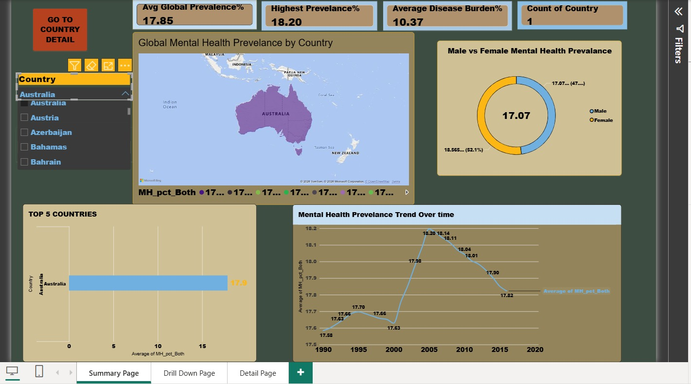
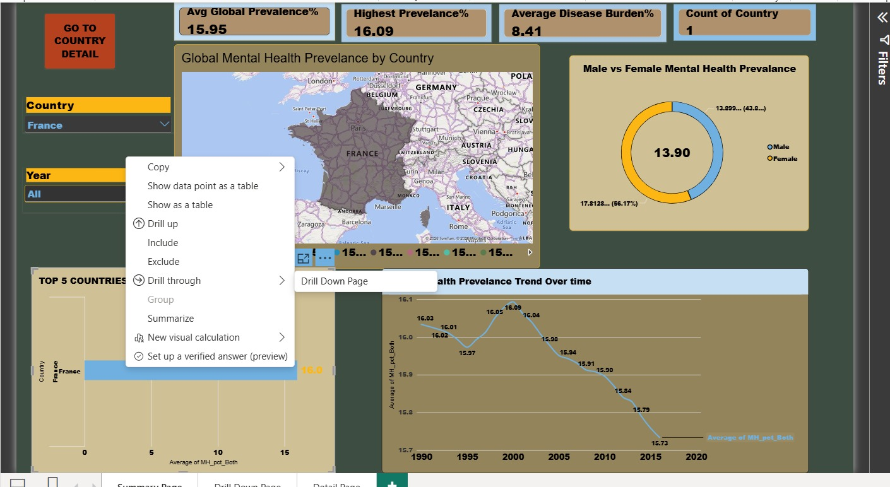
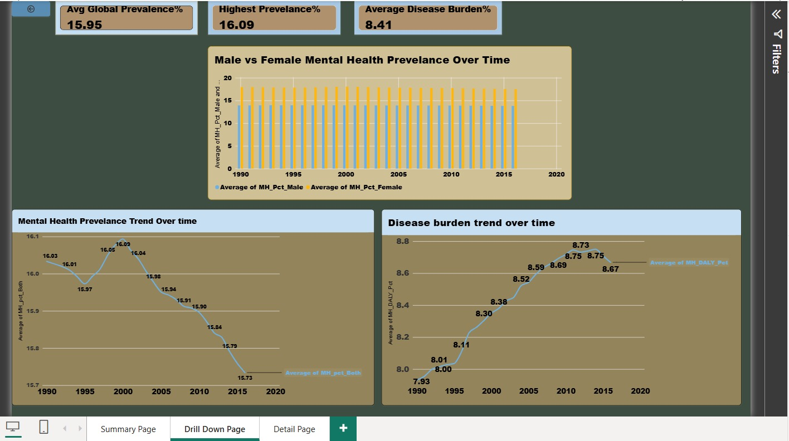
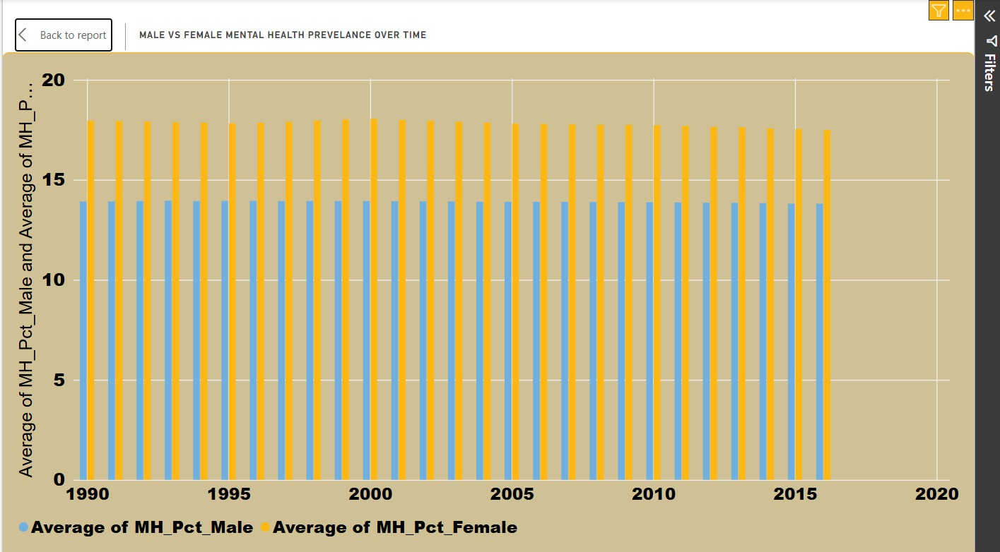
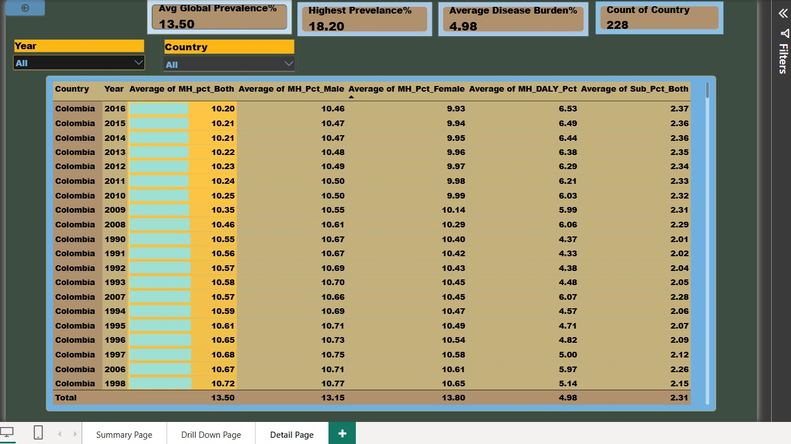
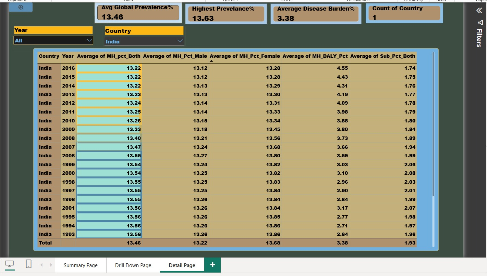

# Global Mental Health Disorder Prevalence Dashboard

**Name:** Suhani Shukla
**Roll No:** 055

## Overview
An interactive Power BI dashboard analyzing global mental health disorder prevalence across approximately 200 countries from 1990 to the present day. This project explores how mental health disorder rates vary by country, gender, and time, and connects prevalence trends to disease burden (DALYs) to understand the broader public health impact.

The dashboard is built across three linked pages — a high-level Summary view, a country-specific Drill Down view (accessed via drill-through), and a raw Detail page for anyone who wants to inspect the underlying numbers directly.

## Dataset
**Source:** Our World in Data (OWID), originally compiled from the Institute for Health Metrics and Evaluation (IHME).

**Dataset name:** "Mental and substance use disorder disaggregated"

**What it contains:**
- Prevalence (%) of mental health disorders, broken down by Both/Male/Female
- Raw case counts for mental health disorders, by gender
- Prevalence (%) and case counts for alcohol and substance use disorders
- DALYs (Disability-Adjusted Life Years) — a standard public health measure of overall disease burden — for both mental health and substance use disorders
- Coverage: ~200 countries and regions, from 1990 to the most recent available year

**Cleaning done in Power Query:**
- Renamed long, technical column headers (e.g., "Prevalence - Mental health disorders: Both (age-standardized percent)") into short, usable names like `MH_Pct_Both`
- Removed unused columns to keep the model lean
- Verified data types (Year as whole number, percentages as decimal) before loading

## Pages

### 1. Summary Page

The landing page of the dashboard, giving a global, bird's-eye view of mental health prevalence.

**Visuals included:**
- A filled world map shading each country by its average mental health prevalence
- Four KPI cards: Average Global Prevalence, Highest Prevalence, Average Disease Burden, and Total Countries covered
- A donut chart comparing global Male vs. Female prevalence
- A bar chart of the Top 5 countries by prevalence
- A line chart showing the global prevalence trend from 1990 to present
- Year and Country slicers, letting the viewer filter every visual on the page at once
- A navigation button that jumps directly to the Drill Down page

### 2. Drill Down Page

This page is reached via **drill-through** — right-clicking any country on the Summary page's map or Top 5 chart and selecting "Drill through → Drill Down Page" filters this entire page down to that one country.

**Visuals included:**
- A clustered column chart comparing Male vs. Female prevalence over time, for the selected country
- A line chart of that country's mental health prevalence trend
- A line chart of that country's disease burden (DALY) trend
- Three KPI cards reflecting that country's own Average Prevalence, Highest Prevalence, and Average Disease Burden
- A "Back to Summary" navigation button

### 3. Detail Page

A raw, table-based view for anyone who wants to see or verify the exact underlying numbers rather than just the visual charts.

**Includes:**
- A full data table: Country, Year, Prevalence (Both/Male/Female), Disease Burden, and Substance Use rates
- Data bars on the prevalence column for quick visual scanning of high vs. low values
- Year and Country slicers to narrow the table down
- KPI summary cards matching the Summary page, for quick reference

## Key Insights
- **Global stability:** Mental health prevalence worldwide has stayed remarkably stable over three decades, hovering between roughly 13.4% and 13.55% — despite major shifts in awareness, diagnosis, and healthcare access over that period.
- **Gender gap:** Female prevalence is consistently higher than male prevalence across the large majority of countries, a pattern that holds across nearly every region.
- **Highest-prevalence countries:** Australia, New Zealand, and Iran report the highest rates globally, all in the 17–18% range — notably higher than the global average.
- **Disease burden trends up even where prevalence doesn't:** in several countries, disease burden (DALYs) rose over time even in years where raw prevalence stayed flat, suggesting the severity or impact of cases may be increasing even when the overall rate isn't.

## Tools Used
- **Power BI Desktop** — dashboard design and visualization
- **Power Query** — data cleaning, column renaming, and transformation
- **DAX** — custom measures for averages, maximums, and distinct counts

## Files in this Repository
- `disease prevelance.pbix` — the full Power BI project file
- `data/mental_health_disorder-055.xlsx` — the cleaned dataset used to build the dashboard
- `images/` — dashboard screenshots referenced in this README
